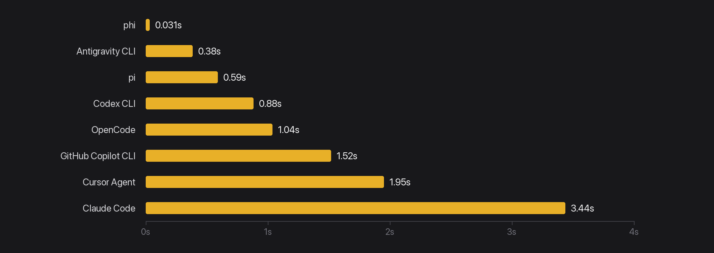
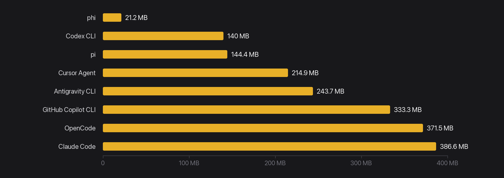
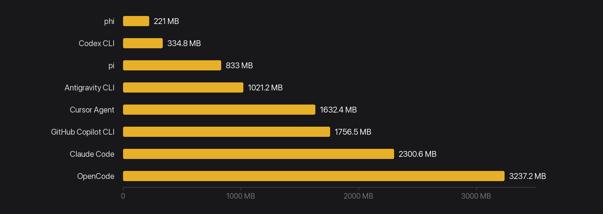

<p align="center">
  
</p>

<p align="center">
  <a href="https://pulseaiclub.github.io/"></a>
  <a href="https://discord.gg/UnyHB3tvRk"></a>
  <a href="README.zh-CN.md"></a>
  <a href="https://github.com/pulseaiclub/phi/blob/main/LICENSE"></a>
  <a href="https://github.com/pulseaiclub/phi/actions"></a>
  <a href="https://go.dev"></a>
  <a href="https://github.com/pulseaiclub/phi/releases"></a>
</p>

- 15 MB · ~31 ms  · sub-agents · anchored sloppy edits · permission gate · progressive MCP · PXB extensions · native diff review & code selection · OpenAI / Anthropic / Gemini


- [Docs](https://pulseaiclub.github.io/docs/getting-started/)
- [Quick start](#quick-start)
- [Footprint](#footprint)
- [Configuration](#configuration)
- [Interactive mode](#interactive-mode)
- [Diff review](#diff-review)
- [Code viewer](#code-viewer)
- [Commands](#commands)
- [Sessions](#sessions)
- [Headless mode](#headless-mode)
- [Skills](#skills)
- [Permissions](#permissions)
- [Extensions](#extensions)
- [MCP](#mcp)
- [Tools](#tools)
- [Project layout](doc/project-layout.md)

## Quick start

Install the latest release (macOS / Linux):

```sh
curl -fsSL https://raw.githubusercontent.com/pulseaiclub/phi/main/scripts/install.sh | bash
```

Windows (PowerShell 5.1+):

```powershell
irm https://raw.githubusercontent.com/pulseaiclub/phi/main/scripts/install.ps1 | iex
```

First launch needs a model. Open the config editor (creates `~/.phi` layout
and writes `~/.phi/config.yaml`):

```sh
phi config
```

Or set env vars for a one-off run:

```sh
export PHI_MODEL=gpt-4o
export PHI_API_KEY=sk-...
```

Then start the TUI:

```sh
phi
```

Or build from source (Go 1.26.3+, see `go.mod`):

```sh
make build          # produces ./phi
make install        # build and install into $GOBIN
```

On first start, phi automatically creates `~/.phi/{bin,skills,hooks,session}`. Search
tools (`fd`, `rg`) download into `~/.phi/bin` in the background when missing.

The TUI gives the model four core tools — `read`, `write`, `edit`, and
`bash` — plus `grep`, `find`, and `ls`. The model uses these to
fulfill your requests. External HTTP fetch is available via MCP when configured.

## Footprint

Lean is not enough — phi is built to feel instant and stay cheap under load.
phi numbers are a stripped release build (`CGO_ENABLED=0`, `-ldflags="-s -w"`)
on macOS arm64. Other harnesses use published Linux PSS / interactive PTY
figures.

### Time to first frame

<p align="center">
  
</p>

### Idle RAM · 1 session

<p align="center">
  
</p>

### Idle RAM · 10 sessions

<p align="center">
  
</p>

| Metric | phi |
| --- | ---: |
| Release binary | **~15 MB** |
| Idle RSS (1 session) | **~21 MB** |
| 10 idle sessions (total RSS) | **~221 MB** |
| Time to first frame | **~31 ms** (26–49 ms) |
| Cold `go build` (empty `GOCACHE`) | **~5.5 s** |
| Warm rebuild | **~0.7 s** |
| Go source (excl. tests) | **~22k LOC** / 107 files |
| Go packages | **32** |
| Direct module deps | **6** (15 modules total) |
| Linked runtimes | system libs only (no Node / Electron / Python) |

## Configuration

phi reads `~/.phi/config.yaml` (standard YAML). Environment variables
override it for one-off runs. `phi config` opens a full-screen terminal editor
for the same file — nothing is written until you save, and the previous file is
kept as `config.yaml.bak`.

```
phi config keys
  ↑↓ ←→      move / cycle a value        a   add a model
  ⏎          edit or open a picker       d   delete the focused row
  esc        close, or quit              f   fetch model ids from the provider
  ^s         save                        s   save        q  quit
```

An empty field means "not set", i.e. the value the loader would fill in; the
placeholder shows that value.

```yaml
# ~/.phi/config.yaml
models:
  - name: gpt-4o
    api: OpenAI             # OpenAI | OpenAIResponses | Anthropic | Gemini (empty → OpenAI-compatible)
    api_key: sk-...         # or set PHI_API_KEY
    base_url: https://api.openai.com/v1   # default; PHI_BASE_URL overrides
    context_window: 128000  # optional
    default: true           # the model used at startup; first entry wins if absent
  - name: claude-sonnet-4-20250514
    api: Anthropic          # required — no name/URL guessing
    api_key: sk-ant-...
    base_url: https://api.anthropic.com
    context_window: 200000
  - name: deepseek-flash    # built-in preset: base_url / context / thinking filled in
    api_key: sk-...
  - name: gemini-2.5-flash  # built-in preset (api: Gemini)
    api_key: ...
    think_level: high       # optional: off | minimal | low | medium | high | …

skill_path: ~/.phi/skills # where SKILL.md files are loaded from

agents:
  enabled: true           # default; set false to disable agent_* sub-agent tools
  models:                 # optional per-role defaults; omit → inherit parent model
    explore: cheap-model
    review: strong-model
    worker: coding-model

permissions:
  mode: interactive       # interactive | readonly | autopilot | headless-strict
  bash:
    default: ask          # ask | allow | deny
    allow:
      - "go test ./..."
    deny:
      - "rm -rf *"
```

Built-in presets and thinking wire formats: [doc/models.md](doc/models.md).

Environment overrides:

| Variable         | Overrides          |
| ---------------- | ------------------ |
| `PHI_API_KEY`    | `models[].api_key` (default model) |
| `PHI_MODEL`      | `models[].name` (default model) |
| `PHI_BASE_URL`   | `models[].base_url` (default model) |
| `PHI_SKILL_PATH` | `skill_path`       |
| `PHI_THINK_LEVEL` | `models[].think_level` (default model; `off` disables) |
| `PHI_OPTIMIZER`  | Master on/off switch for optimizer features (`0`, `false`, `off`, `no` to disable) |
| `TYPESAFE_API_KEY` | TypeSafe API key required for optimizer features |

**Security:** When `PHI_OPTIMIZER` is enabled, command history and context are sent to an external TypeSafe service for judging and ranking. Avoid using the optimizer in environments where shell history may contain sensitive information (API keys, tokens, credentials).
Provider routing uses the explicit `api` field (`OpenAI` / `Anthropic` /
`Gemini`). See [Supported models](doc/models.md).

### Workspace layout

```
~/.phi/
├── config.yaml   # global configuration
├── bin/          # downloaded search tools (fd, ripgrep)
├── skills/       # SKILL.md skill directories
├── extensions/   # PXB binaries + phi.yaml
├── jobs/         # sub-agent job artifacts (meta, logs, result.md)
└── session/      # persisted sessions, one dir per working directory
    └── <encoded-cwd>/
```

## Interactive mode

`phi` (or `phi tui`) starts the TUI: a chat transcript on top, an editor at
the bottom, and a footer with the current activity. When a newer release is
available, the footer shows a hint like `0.2.0 available · phi update`.

Assistant output is rendered as Markdown (CommonMark/GFM): headings, emphasis,
strikethrough, links, blockquotes, lists, task checkboxes, and tables are
styled with the active theme; fenced code blocks get a muted language caption and per-language
syntax highlighting. Structural markers (`#`, `` ` ``, `*`) are stripped.

The editor supports:

- `@` — fuzzy file mention picker (type `@` and start typing a path)
- `/` — slash command picker (`/sessions`, `/branch`, `/new`, `/diff`, `/code`)
- `?` — shortcut help picker (lists `/`, `!`, `@`, and key bindings; `Esc` closes)
- `!command` — run a shell command locally and stream its output into the
  transcript (see [Commands](#commands))
- `Ctrl+K` — command palette: settings → model / theme / permissions / agents (incl. per-role models), skills, hooks

### Keyboard shortcuts

| Key            | Action                          |
| -------------- | ------------------------------- |
| `Ctrl+C`       | Quit phi                        |
| `Esc`          | Cancel the running agent / close pickers |
| `Ctrl+K`       | Toggle the command palette      |
| `Ctrl+A`       | Jump to the start of the line   |
| `Ctrl+E`       | Jump to the end of the line     |
| `Ctrl+U`       | Clear the composer input, images, and skills |
| `Ctrl+Shift+C` | Copy the selected transcript text |

Themes: `Dark` (default), `Darcula`, `Pink`, and `Terminal`, switchable from
the palette under settings → theme.

## Diff review

`/diff` is a full-screen git review inside the TUI — read the change, leave
line notes, then hand them to the agent without leaving the terminal.

| Command | What opens |
| --- | --- |
| `/diff` | Working tree (`git diff`) |
| `/diff staged` | Staged changes |
| `/diff HEAD` | Last commit (`git show`) |

Slash-picker Enter inserts `/diff` plus a trailing space into the composer; submit to open. Inside the overlay:
`s` side-by-side, `i` add/edit a note, `x` delete, `a` send notes to the agent,
`?` help, `q` / `Esc` close. Notes live in the overlay's memory only — switching
diffs drops them and nothing is written to disk.

## Code viewer

`/code <path>[:line]` opens a full-screen source viewer: syntax highlighting, a
CJK-aware caret (`j`/`k`, `h`/`l`, `gg`/`G`), in-file search (`/`, then `n`/`N`),
`:line` to jump to a line, and `v` for lines or `p` for the paragraph under the
caret, then `a` to hand the selection to the chat input as a `path:12-18`
reference the model reads. The pane reads files itself and answers to the same
deny list as the tool gate, so sensitive paths (`~/.ssh`, `.env`, …), binaries
and files over 8 MiB are refused with a toast.

`Esc` closes, or cancels a search back to where `/` was pressed. The status row
shows the path, caret and line count while reading, the selection size while `v`
is active, and the match counter (`2/5`) while a search is live.

## Branch switching

`/branch` opens the branch picker for the working directory. Two columns: the
branch name, and its most recent commit. A `●` marks the branch HEAD is on. Rows
are ordered where you are, where you came from (git reflog), the other local
branches, then remote-tracking branches.

Enter runs `git switch` on the selected row — off the UI goroutine, so a slow
checkout does not freeze the composer. Picking a remote row checks out the local
branch that tracks it, the same thing `git switch feat` does for `origin/feat`.

`/branch <name>` skips the picker: it switches to that branch, or creates it
from HEAD when no branch carries the name yet. Naming is the whole "new branch"
flow — three characters typed beat a form.

Uncommitted work is never touched: git refuses rather than lose it, and its
reason is toasted verbatim. Switching is blocked while a reply or command is
running, and while a merge, rebase, cherry-pick, revert, or bisect is
unfinished.

## Commands

| Command            | Description                                   |
| ------------------ | --------------------------------------------- |
| `phi` / `phi tui`  | Start the interactive TUI                     |
| `phi run -p "…"`   | Run one agent loop headlessly (see below)     |
| `phi update`       | Download and install the latest GitHub release |
| `phi update --check` | Query the latest release without installing |
| `phi sessions list`| List persisted sessions for this directory    |
| `/sessions`        | List sessions for this directory (TUI)        |
| `/branch`          | Switch the working branch — see [Branch switching](#branch-switching) |
| `/new`             | Start a fresh empty session (TUI)             |
| `/diff`            | Full-screen git review — see [Diff review](#diff-review) |
| `/code`            | Full-screen source viewer — see [Code viewer](#code-viewer) |
| `!command`         | Run a shell command locally, stream output into the transcript; `Esc` cancels it |

In the TUI, `!command` runs locally via `bash -c` — outside the agent loop. It
doesn't count toward agent busy state, and the running command can be cancelled
with `Esc` without touching an in-flight agent turn.

## Sessions

Sessions persist automatically per working directory under
`~/.phi/session/<encoded-cwd>/` as JSONL trajectories.

- `phi sessions list` — list session id, mtime, and preview for the current
  directory
- `/sessions` in the TUI — same, in-app
- `/new` — start a fresh session (new id, empty transcript)
- `phi run --session <id>` / `phi run --continue-last` — resume headlessly

## Headless mode

```sh
phi run -p "fix the failing test in internal/tools"
```

Runs one agent loop without a TUI. Human logs go to stderr; with `--jsonl`,
machine-readable events go to stdout, one JSON object per line.

Flags:

| Flag                 | Description                                    |
| -------------------- | ---------------------------------------------- |
| `-p, --prompt STRING`| Prompt to run (required)                       |
| `--jsonl`            | Emit JSONL events to stdout                    |
| `--yolo`             | Skip all permission checks for this run (benchmarks / CI only) |
| `--max-rounds N`     | Cap tool rounds (default 64)                   |
| `--timeout DURATION` | Limit the agent run wall-clock time (e.g. `10m`; disabled by default) |
| `--session ID`       | Resume a persisted session by id or unique prefix |
| `--continue-last`    | Resume the newest persisted session for this directory |
| `--session-dir DIR`  | Override the session storage directory         |
| `--tools LIST`       | Enable only these comma-separated built-in tools |

`--tools` accepts built-in names such as `read,ls,grep`. MCP and agent tools
still append when configured; the flag only scopes the built-in toolset.

Exit codes: `0` success · `1` runtime/LLM error · `2` max rounds reached ·
`3` config/usage error.

In the interactive TUI, exhausting the tool-round budget prompts Continue /
Stop. Headless `phi run` has no confirmation UI, so it exits with code 2.

In headless mode, permission `ask` decisions are denied (there is no approval
UI), so `readonly`-style safety applies without extra flags. For benchmarks
that need arbitrary shell (`pytest`, `npm test`, …), pass `--yolo` to skip the
permission gate for that run only.

## Skills

Skills are directories containing a `SKILL.md` file with YAML frontmatter and
a Markdown body. They are loaded from `~/.phi/skills/` (or `skill_path` /
`PHI_SKILL_PATH`) and injected into the agent's context, letting you give the
model reusable procedures:

```markdown
---
name: My Skill
 description: What this skill does
license: MIT
compatibility: claude, openai
---
Instructions the agent should follow when this skill is relevant.
```

In the TUI, add skills from the palette (skills → list), then submit the
message with the selected skills applied.

## Permissions

Tool execution is gated by a permission policy, so the agent can run read-only
by default and ask before anything destructive. Configure it under
`permissions:` in `~/.phi/config.yaml`.

Modes:

| Mode               | Behavior                                            |
| ------------------ | --------------------------------------------------- |
| `interactive`      | Default. `ask` decisions prompt in the TUI.         |
| `readonly`         | Deny writes / bash; read tools still work.          |
| `autopilot`        | Fold `ask` → allow, run unattended.                 |
| `headless-strict`  | Fold `ask` → deny (used by `phi run`).              |

Per-tool rules: `bash.default` / `bash.allow` / `bash.deny` (exact command
prefix matching). Global keys:
`workspace_only_writes` (default true), `ask_timeout_sec`, and
`dangerously_allow_all` (default false).

In the TUI, an approval dialog replaces the editor with options to approve,
deny with feedback, or allow all for the session / for every session. The
palette's settings → permissions entry toggles session-wide bypass.

## Extensions

Extensions are native binaries speaking the **PXB** binary protocol over
stdin/stdout (author SDKs: Go `github.com/pulseaiclub/phi/ext/go/phi`, Rust
[`ext/rust`](ext/rust) (`phi-ext`), and TypeScript
[`ext/ts`](ext/ts) (`@pulseaiclub/phi-ext`)). They
subscribe to tool/session events, register LLM tools, and add slash commands.

```bash
go get github.com/pulseaiclub/phi/ext/go@v0.21.0
```

```go
package main

import (
	"github.com/pulseaiclub/phi/ext/go"
	"github.com/pulseaiclub/phi/ext/go/phi"
)

func main() {
	m := phi.New("hello", "0.1.0")
	m.OnToolCall(func(ev ext.ToolCallEvent) *ext.ToolCallResult {
		// return &ext.ToolCallResult{Block: true, Reason: "..."}
		return nil
	})
	_ = m.Run()
}
```

Install under `~/.phi/extensions/<name>/` with a `phi.yaml` pointing at the
binary. In the TUI: `Ctrl+K` → **extensions**. Disable with
`PHI_EXTENSIONS=off`. Full guide: [doc/extensions.md](doc/extensions.md).

Codec throughput on Apple Silicon (release, single-threaded):

| Implementation | Hello encode+decode | Frame write+read (in-memory) | Allocs |
|---|---|---|---|
| Rust PXB (`phi-ext`) | ~0.12 µs | ~0.06 µs | — |
| Go PXB (`ext/go/pxb`) | ~0.11 µs | ~0.05 µs | 3 / op |
| Go JSON lines | ~1.2 µs | — | 15 / op |

The ~10× gap over JSON lines is the protocol (fixed header + tagged fields), not
the language — Rust and Go are within noise on the same codec work. Real
extension latency is dominated by process spawn and pipe RTT anyway. Re-probe:
`cargo run --release --example bench` in [`ext/rust`](ext/rust).

## MCP

**Configure 100 MCP servers. Pay ~0 schema tokens until you call one.**

Most MCP hosts dump every `tools/list` schema into the model context before
you ask a question — browser stacks alone can burn 50k+ tokens. phi does not.

Instead the agent gets three meta-tools, and the system prompt lists configured **server names** (no schemas):

| Tool | Role |
| --- | --- |
| `mcp_list` | List tool **names** on one server (compact text) |
| `mcp_inspect` | Fetch a slim parameter summary for one tool |
| `mcp_call` | Run `server` + `tool` + `args` |

Flow: pick a server from the prompt → `mcp_list(server=…)` → `mcp_inspect` → `mcp_call`. Subprocesses start **lazily** on first use.
Calls still go through PreHooks → Gate / Ask → Run → PostHooks.

```sh
phi mcp add browsermcp -- npx @browsermcp/mcp@latest
phi mcp doctor
# In the TUI, the model can use configured servers without guessing MCP exists
```

Config: `~/.phi/mcp.json` (project `<cwd>/.phi/mcp.json` overrides by name).
Disable with `PHI_MCP=off`. Stdio and HTTP in v1.

Full guide: [doc/mcp.md](doc/mcp.md).

## Sub-agents

Sub-agent tools (`agent_spawn`, `agent_wait`, …) are **on by default**. To
keep a session lean, disable them in `~/.phi/config.yaml`:

```yaml
agents:
  enabled: false
```

Or toggle for the current session via the palette: settings → agents.
When disabled, those tools are not registered and the model cannot spawn jobs.

Per-role model defaults (optional) under `agents.models` pick which configured
model name each role uses when spawned. Omitted roles inherit the parent
session model. Switch for the current session only via
settings → agents → models → explore|review|worker (same session-only semantics
as settings → model; does not write `config.yaml`).

Sub-agents themselves use a **role** (`explore` default | `review` | `worker`):

| Role | Tools | Use for |
|------|--------|---------|
| `explore` | no write/edit; bash except hard denies | Multi-hop recon / map structure |
| `review` | same as explore | Diffs / checks; report only |
| `worker` | full tools except nesting; bash except hard denies | Scoped, self-contained edits |

Default stays explore (no edits). Prefer worker when the task is to implement a scoped change in an isolated context.

## Tools

Built-in tools the model can call (see `internal/tools/`):

| Tool           | Purpose                                      |
| -------------- | -------------------------------------------- |
| `bash`         | Run a shell command in the working directory |
| `read`         | Read a file                                  |
| `write`        | Write a file (gated by permissions)          |
| `edit`         | Targeted edit of a file                      |
| `grep`         | Regex search across files                    |
| `find`         | File patterns (fd)                           |
| `ls`           | Directory listing                            |
| `agent_spawn`  | Start an isolated sub-agent job (async)      |
| `agent_wait`   | Wait for a job; returns short summary only   |
| `agent_cancel` | Cancel a running job                         |

Sub-agent transcripts live under `~/.phi/jobs/<id>/` and are **not** injected
into the parent context — only the wait/task summary is.

Fast search tools (`fd`, `ripgrep`) are downloaded on first startup into
`~/.phi/bin` when missing.

See [Project layout](doc/project-layout.md) for the source tree map.

See [CONTRIBUTING.md](CONTRIBUTING.md) for development setup, code style, and
commit conventions.
